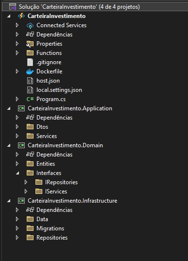

# Arquitetura de solução


### Recepção do Arquivo Excel:
A aplicação possui um endpoint que recebe um arquivo Excel contendo as movimentações baixadas da B3. Este arquivo é enviado via um formulário multipart/form-data.

### Armazenamento no Blob:
Assim que o arquivo chega, ele é armazenado em um Blob Storage (um serviço de armazenamento de arquivos, como o Azure Blob Storage).

### Processamento do Arquivo:
Ao ser armazenado no Blob, um trigger (função) é ativado. Essa função lê o conteúdo do arquivo Excel, processa as movimentações e grava os dados extraídos na base de dados.

### Arquivo Arquivado:
Após o processamento, o arquivo original é movido para um Blob de Arquivo Arquivado, separando-o dos arquivos em processamento.

### Resumo das Movimentações:
Quando o arquivo é movido para o Blob de Arquivo Arquivado, outra função é disparada. Essa função acessa a base de dados, recupera todas as movimentações já registradas e calcula o resumo, como o saldo de ações e o valor investido, consolidando as informações para análise.


# Arquitetura de Projeto:

<!-- /CarteiraInvestimento
|-- /src
|   |-- /Functions (Projeto de Azure Functions)
|   |   |-- FechamentoFunction.cs
|   |   |-- ReadFileFunction.cs
|   |   |-- ResumoFunction.cs
|   |   |-- UploadFunction.cs
|   |   |-- UploadMultipleFilesFunction.cs
|
|   |-- /Application (Projeto de Aplicação)
|   |   |-- /Services
|   |   |   |-- BlobService.cs
|   |   |   |-- ExcelService.cs
|   |   |   |-- MovimentacoesResumoService.cs
|   |   |
|   |   |-- /DTOs
|   |   |   |-- MovimentacoesDto.cs
|
|   |-- /Domain (Projeto de Domínio)
|   |   |-- /Entities
|   |   |   |-- Indicadores.cs
|   |   |   |-- Movimentacoes.cs
|   |   |   |-- MovimentacoesResumo.cs
|   |   |   |-- Ticker.cs
|   |   |   |-- TickerSetor.cs
|   |   |-- /Interfaces
|   |   |   |-- /IRepositories
|   |   |   |   |   |-- IIndicadoresRepository.cs
|   |   |   |   |   |-- IMovimentacoesRepository.cs
|   |   |   |   |   |-- IMovimentacoesResumoRepository.cs
|   |   |   |   |   |-- ITickerRepository.cs
|   |   |   |   |   |-- ITickerSetorRepository.cs
|   |   |   |-- /IServices
|   |   |   |   |   |-- IIndicadoresRepository.cs
|   |   |   |   |   |-- IMovimentacoesRepository.cs
|   |   |   |   |   |-- IMovimentacoesResumoRepository.cs
|   |   |   |   |   |-- ITickerRepository.cs
|   |   |   |   |   |-- ITickerSetorRepository.cs
|   |   |   |      
|   |-- /Infrastructure (Projeto de Infraestrutura)
|   |   |-- /Data
|   |   |   |-- AppDbContext.cs
|   |   |   |
|   |   |-- /Repositories
|   |   |   |-- IndicadorRepository.cs
|   |   |   |-- MovimentacoesRepository.cs
|   |   |   |-- MovimentacoesResumoRepository.cs
|   |   |   |-- TickerRepository.cs
|   |   |   |-- TickerSetorRepository.cs
|   |   |
|   |   |-- /Migrations
|   |   |   |-- AppDbContextModelSnapshot.cs
|   |   |   |-- Migration1.cs
|   |
|-- /tests (Projeto de Testes)
|   |-- /ApplicationTests
|   |-- /DomainTests
|   |-- /InfrastructureTests -->

### Vantagens da Arquitetura Adotada:
A separação entre serviços e repositórios no seu projeto oferece diversas vantagens importantes:

- **Desacoplamento**: A lógica de negócios e a persistência de dados são isoladas, permitindo que mudanças em uma parte não afetem a outra.
- **Facilidade de Testes**: Com repositórios e serviços separados, é mais fácil criar testes unitários, pois você pode mockar as dependências sem afetar a lógica de negócios.
- **Escalabilidade**: A modularidade facilita a adição de novos recursos ou mudanças na arquitetura sem impactar o sistema inteiro.
- **Manutenção Simples**: A estrutura bem definida permite identificar rapidamente problemas e aplicar correções de forma eficiente.


# Como Iniciar o Projeto

### Requisitos

Para rodar o projeto, é necessário ter as seguintes dependências instaladas:

1. **Docker Desktop**  
   O projeto utiliza containers Docker para emular o ambiente de produção. Caso não tenha o Docker Desktop instalado, você pode baixá-lo [aqui](https://www.docker.com/products/docker-desktop/).

2. **.NET 8 SDK**  
   O projeto foi desenvolvido utilizando o **.NET 8 SDK**. Certifique-se de ter o SDK do .NET 8 instalado em sua máquina. Você pode baixá-lo [aqui](https://dotnet.microsoft.com/download/dotnet/8.0).

### Dependências Opcionais

3. **Azure Data Explorer**  
   Se você deseja integrar ou explorar dados no Azure Data Explorer, é recomendado instalar o **Azure Data Explorer**. Mais informações podem ser encontradas [aqui](https://learn.microsoft.com/en-us/azure/data-explorer/).
   

4. **SQL Server Management Studio (SQL Management Studio)**  
   Para facilitar a administração e gerenciamento do banco de dados SQL Server, você pode instalar o **SQL Server Management Studio (SSMS)**. Ele fornece uma interface gráfica rica para gerenciar o banco de dados. Baixe o SSMS [aqui](https://aka.ms/ssmsfullsetup).

### Passos para Execução

1. **Subir os Containers**  
   Após instalar o Docker, inicie os containers do Azurite e do SQL Server utilizando o comando:
   ```
   docker-compose up -d

2. **Rodar a aplicacao**  
   ```
   dotnet run 


# Documentação do Endpoint

Este endpoint permite o upload de arquivos. Ele espera receber um arquivo como parte de um formulário `multipart/form-data`.

## Endpoint: `POST /upload`

### Descrição

Este endpoint é utilizado para realizar o upload de um arquivo. Ele recebe um arquivo enviado através de um formulário de upload e retorna uma resposta com o status da operação.

### Requisitos

- O arquivo deve ser enviado com o tipo de conteúdo `multipart/form-data`.
- O endpoint espera um arquivo de qualquer tipo (xlsx ou xls), mas recomenda-se verificar a extensão e o tamanho do arquivo no servidor, conforme necessário.

### Corpo da Requisição

A requisição deve ser do tipo `POST` e enviar um arquivo como parte de um formulário `multipart/form-data`. O arquivo deve ser enviado com o campo nomeado `file`.


# Como o Azurite Ajuda no Desenvolvimento Local e Testes
1. ### Desenvolvimento Local Sem Conexão com a Nuvem:
O Azurite permite que os desenvolvedores emulem os serviços de armazenamento do Azure no ambiente local, evitando a necessidade de interagir com o Azure real durante a fase de desenvolvimento. Isso acelera o ciclo de desenvolvimento, pois você pode testar suas interações com o Blob Storage e outros serviços diretamente no seu computador.

2. ### Teste de Funcionalidades de Armazenamento:
Durante o desenvolvimento de sistemas que dependem de uploads de arquivos, como o exemplo mencionado anteriormente (onde o arquivo é enviado para um Blob Storage), o Azurite facilita o teste local dessas funcionalidades. Ao simular o comportamento do Azure Blob Storage, ele permite testar a funcionalidade de upload, leitura, e movimentação de arquivos sem a necessidade de uma conta do Azure, o que reduz custos e facilita o desenvolvimento.

3. ### Compatibilidade com Ferramentas Azure:
Azurite é altamente compatível com as bibliotecas e SDKs do Azure, como o Azure.Storage.Blobs em C# ou outras linguagens. Isso permite que os desenvolvedores testem suas integrações com o Azure Storage de forma quase idêntica ao ambiente real, proporcionando maior confiança nas funcionalidades antes de realizar o deploy para a nuvem.

4. ### Facilidade de Configuração e Execução:
Azurite pode ser facilmente configurado via Docker ou utilizando pacotes locais, permitindo uma emulação rápida e prática. Ao usar comandos simples, como docker-compose up, você pode levantar uma instância local do Azurite e começar a testar suas operações de armazenamento sem complicações.


# Azure Storage Explorer


O Azure Storage Explorer é uma ferramenta gratuita e fácil de usar da Microsoft que permite gerenciar recursos de armazenamento no Azure. Com ele, você pode acessar e interagir com contas de armazenamento, como Blob Storage, File Storage, Queue Storage e Table Storage, de maneira simples. A ferramenta permite realizar operações como upload, download, visualização e exclusão de arquivos, além de facilitar a administração de dados no Azure de forma visual e intuitiva, tanto localmente quanto em ambientes remotos.

você pode baixá-lo [aqui](https://azure.microsoft.com/en-us/products/storage/storage-explorer/#Download-4).

# como logar no banco de dados 
Para acessar o banco de dados, use as seguintes informações de conexão:

- **Nome do Servidor**: `localhost,1433`
- **Usuário**: `sa`
- **Senha**: `P@55w0rd`

Certifique-se de que o container SQL Server esteja em execução e que a porta `1433` esteja liberada para conexões.

# EPPlus
O EPPlus é uma biblioteca popular para trabalhar com arquivos Excel (XLSX) no .NET. Ela permite a leitura, criação e manipulação de planilhas do Excel de maneira eficiente e sem a necessidade de ter o Excel instalado na máquina. Com o EPPlus, você pode:

Criar e editar planilhas Excel.
Ler e escrever células.
Gerenciar estilos de células, gráficos e tabelas.
Processar arquivos Excel de forma rápida e eficaz.
A biblioteca é amplamente utilizada para gerar relatórios, importar ou exportar dados de planilhas, e para diversas operações de manipulação de dados em arquivos Excel no ambiente de desenvolvimento .NET.

### Licenciamento para Uso Não Comercial
Desde a versão 5 do EPPlus, a licença passou a ser comercial por padrão. Isso significa que, para utilizar a biblioteca em um projeto comercial, é necessário adquirir uma licença paga. No entanto, se o seu projeto for não comercial, você pode configurar a biblioteca para usar a licença não comercial.

Para fazer isso, você deve definir o contexto de licença da seguinte maneira:
 ```
    using OfficeOpenXml;

    ExcelPackage.LicenseContext = LicenseContext.NonCommercial;
 ```
Essa configuração permite que você use o EPPlus gratuitamente para projetos não comerciais, como projetos de código aberto, educacionais ou pessoais.